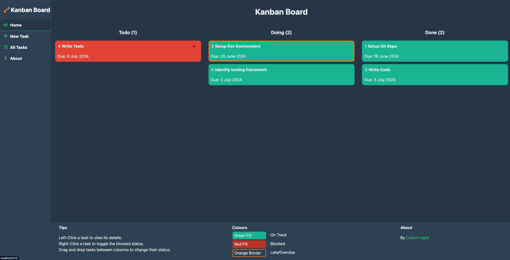
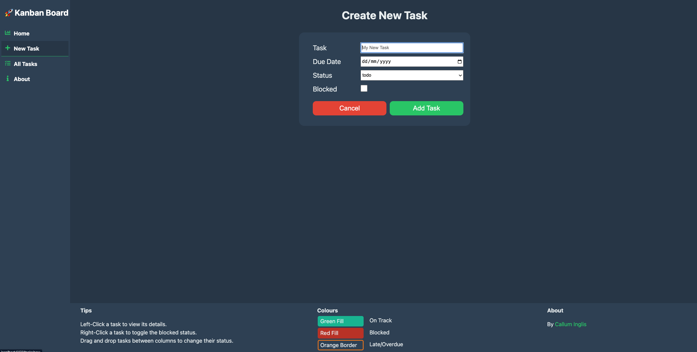
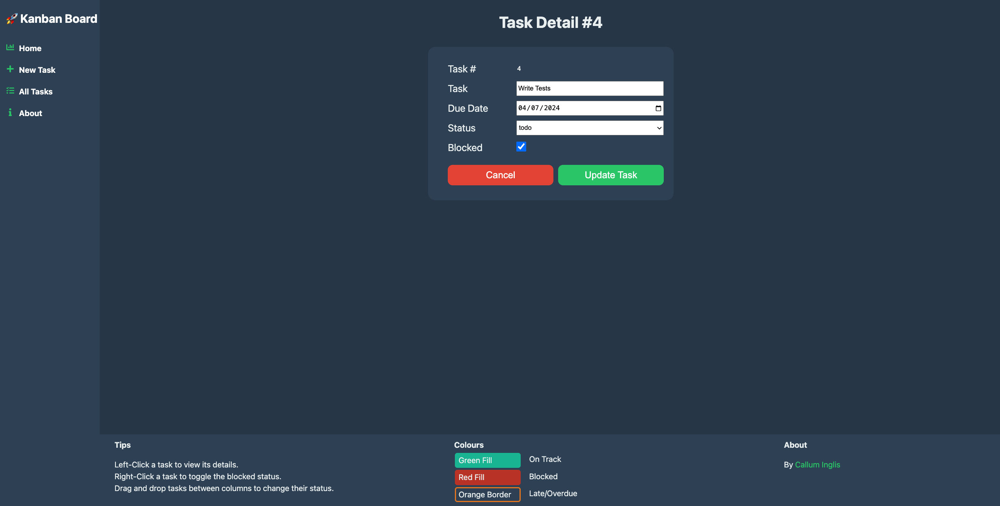
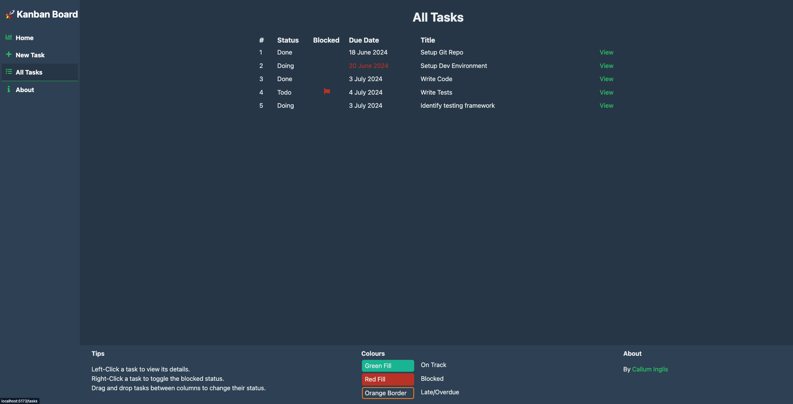
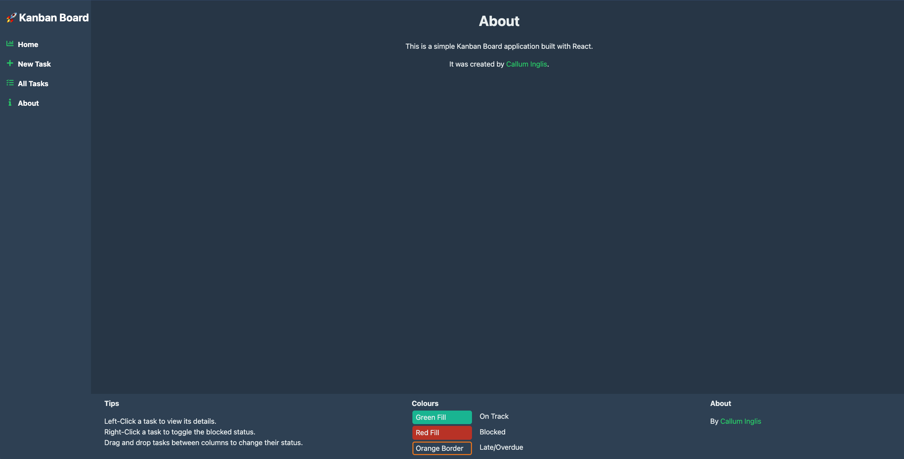

# Kanban Board [](https://app.netlify.com/sites/magenta-dolphin-a4321c/deploys)   
Project tracker as a means to learn React

View: [kanban.sandbox.calluminglis.com](https://kanban.sandbox.calluminglis.com)

## Overview
This project is a simple kanban board that I created to learn React. 

It covers a few key concepts, such as:
- Components
- Props
- State & Lifting State
- Context
- Controlled Forms
- Routing

Out of scope for this project, as of now, are:
- Testing
- TypeScript (Covered elsewhere/in other projects)
- Backend (This is a frontend-only project)
- Local Storage

## Features
- Create, Read, Update tasks
- Drag and drop tasks between columns to update status
- One-click edits, no need to open a modal, to flag as blocked

## Getting Started
1. Clone the repository
2. Install NodeJS & dependencies
3. Run the development server
```bash
git clone git@github.com:TheCallumInglis/learning-react-kanban-board.git
cd learning-react-kanban-board
npm install
npm run dev
```

## Screenshots  
### Kanban Board: `Home Page`  
- Drag & Drop tasks between columns to update status
- Left-click to mark task as blocked
- Right-click to edit task
- Green indicates task is on track
- Red/Flag indicates task is blocked
- Orange border indicates task is overdue



### Add Task: `Add Task Page`
- Add a new task to the board



### Update Task: `Update Task Page`
- Update an existing task



### All Tasks: `All Tasks Page`
- View all tasks in a list format



### About: `About Page`
- Learn more about the project

